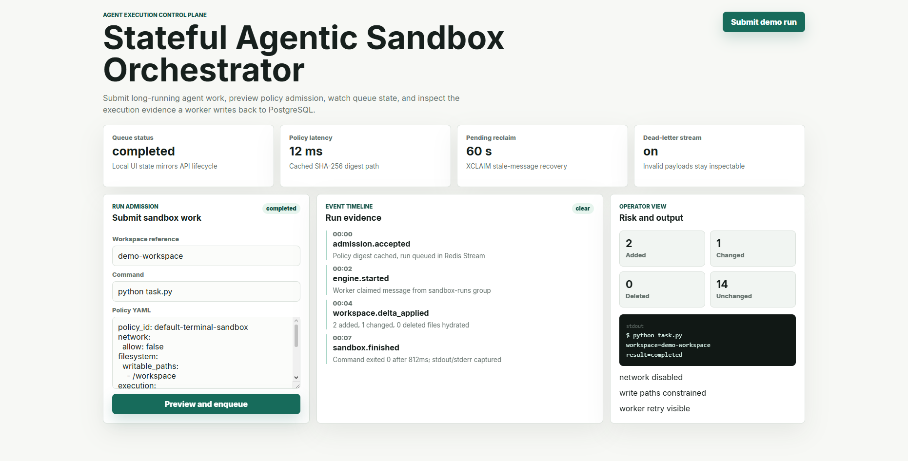
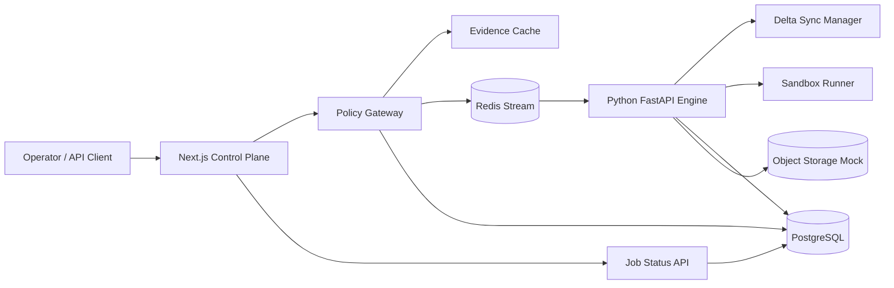

# Stateful Agentic Sandbox Orchestrator

[](https://github.com/Daniel5569/stateful-agentic-sandbox-orchestrator/actions/workflows/ci.yml)




Production-shaped portfolio case study for early-stage AI infrastructure teams building terminal-use agents, remote sandboxes, and long-running asynchronous execution systems.

> **Reviewing this repo?** Clone and run `docker compose up --build -d` — the full stack (Next.js gateway, Python engine, Redis, PostgreSQL) is running in under 2 minutes. Then `curl -X POST http://localhost:3000/api/runs ...` (see [Quick Start](#quick-start)) to submit a run and watch the Python engine process it through Redis Streams. No external accounts required.

## Business Problem

Code-executing agents are one of the fastest-growing infrastructure categories in AI. Every serious AI company building a coding assistant, data analyst, or automation agent needs the same underlying infrastructure: a gateway that enforces policy before execution, a runtime that isolates agents from the host, a queue that decouples admission from long-running jobs, and an audit trail that makes unsafe behavior debuggable after the fact.

None of this is solved by better prompts. It is solved by control-plane architecture — and that is what this repo demonstrates.

**Specific problems this system addresses:**

- A serverless function times out at 30 seconds; a code agent needs minutes → decouple via Redis Streams, return `202 Accepted` immediately
- An agent writes to the wrong file and corrupts shared state → delta-based workspace hydration, per-job isolated directories
- A policy check runs after execution, not before → compile YAML policies into deterministic constraint trees at admission time
- A failed sandbox leaves state in an unknown condition → structured execution events, inspectable after failure, stale messages recovered via XCLAIM

This monorepo demonstrates a split Node.js + Python architecture:

- **Node.js / Next.js** owns the product surface, API gateway, policy validation, and queue admission control.
- **Python / FastAPI** owns the computational runtime, sandbox lifecycle simulation, delta-based workspace hydration, and execution telemetry.
- **Redis Streams** decouple request admission from long-running agent execution through a cross-runtime queue contract.
- **PostgreSQL** persists jobs, policy decisions, sandbox manifests, and execution events.
- **Docker Compose** runs the full stack locally without leaking secrets.

The project is intentionally built as a public proof of work: it is small enough to inspect, but it contains the same control-plane boundaries used by real agentic infrastructure companies.

## Why This Exists

Terminal-use and code-executing agents fail in production when infrastructure teams treat them like normal request/response web apps. The hard problems go beyond prompt quality. They are:

- keeping execution state warm without trusting local disk,
- enforcing deterministic policy decisions before runtime execution,
- avoiding serverless timeout ceilings,
- making sandbox state inspectable after failure,
- providing enough audit evidence to debug unsafe behavior,
- preserving low admission latency while long jobs run elsewhere.

This system addresses those problems with an asynchronous split between a gateway and a sandbox engine.

## Demo


The demo shows the intended operator flow: submit a run, receive `202 Accepted`, poll the run state, then inspect persisted execution events after the Python engine finishes the sandbox job.

## Architecture



## Runtime Boundaries

```text
apps/web
  Next.js API gateway, admission control, Redis stream producer, policy compiler

services/engine
  FastAPI internal health API, Redis stream consumer group, delta sync engine, sandbox runner

packages/shared
  Cross-runtime JSON contracts and examples

infra
  PostgreSQL bootstrap SQL and policy examples
```

The gateway never blocks on agent execution. It validates policy, persists an accepted job, enqueues work, and returns a job id. The Python engine consumes jobs asynchronously through a Redis consumer group and writes incremental events.

## Asynchronous Flow

```text
1. Client submits an agent run request to POST /api/runs.
2. Node validates the YAML policy into deterministic in-memory constraints.
3. Node stores the policy evidence and job metadata in PostgreSQL.
4. Node publishes the job to Redis and immediately returns 202 Accepted.
5. Python worker consumes the job from Redis.
6. Python computes a workspace delta from the object-storage manifest.
7. Python hydrates only changed files into the sandbox workspace.
8. Python runs the sandbox command through a constrained runner.
9. Python writes events, timings, risk flags, and final status to PostgreSQL.
10. Client polls GET /api/runs/:id or observes events from the database/API.
```

## Evidence Cache

The Node gateway compiles YAML policies into deterministic constraint trees:

```yaml
policy_id: default-terminal-sandbox
network:
  allow: false
filesystem:
  writable_paths:
    - /workspace
execution:
  max_seconds: 45
  denied_commands:
    - curl
    - nc
    - ssh
```

The compiled cache is stored in memory and versioned by a SHA-256 digest. This makes admission checks fast, reproducible, and auditable. The test suite enforces a representative admission budget under 100ms for normal policies.

## Performance Characteristics

These numbers are local reference characteristics, not hosted production SLOs. They are included so the claims are inspectable and can be re-run or challenged during a technical interview.

| Path | Methodology | Reference Result | Guardrail |
| --- | --- | --- | --- |
| Policy admission | Vitest compiles a representative YAML policy and validates the deterministic constraint tree | single-digit milliseconds on localhost | `<100ms` test assertion |
| Queue admission | Next.js writes one accepted run to PostgreSQL and appends one Redis Stream entry | one network round trip to Postgres plus one Redis `XADD` | no synchronous engine call |
| Delta sync warm start | Pytest hydrates the same workspace twice and compares file hashes | second run copies `0` files | unchanged files must remain untouched |
| Sandbox timeout | Pytest executes a sleeping process with an immediate timeout | process is killed and marked `timedOut=true` | no unbounded execution |

For a production benchmark, run the stack with Docker and sample admission latency at the gateway while the engine consumes stream entries in parallel. The intended measurement is p50/p95/p99 over `POST /api/runs`, Redis stream lag, and delta-sync file counts per run.

## Delta Sync Model

Cold-start latency is reduced by avoiding full workspace downloads. The engine compares:

- central manifest: object storage snapshot of expected files,
- local manifest: current hydrated workspace files,
- deterministic hash digests: SHA-256 per file.

Only changed files are copied into the sandbox workspace. Deleted files are removed. The resulting delta manifest is persisted with each run.

## Security Model

This repository uses a portable sandbox runner for local demonstration. The boundary is intentionally designed so that it can be replaced by Bubblewrap, Docker namespaces, Firecracker, gVisor, or a remote sandbox provider.

Implemented controls:

- admission policy compilation before queueing,
- denied command validation,
- read-only policy evidence persistence,
- isolated per-job workspace directory,
- bounded execution timeout,
- structured execution events,
- Docker network isolation: only the Node gateway exposes a host port,
- no secrets committed to the repository.

Production extensions:

- Bubblewrap profile generation,
- seccomp/AppArmor policy,
- egress proxy with allow-listing,
- object storage backed by S3/GCS/R2,
- short-lived signed workspace credentials,
- WebSocket event streaming,
- immutable audit log storage.

## Trade-Offs

| Decision | Benefit | Cost |
| --- | --- | --- |
| Redis queue between Node and Python | Avoids gateway timeout and runtime coupling | Requires queue observability |
| PostgreSQL for audit events | Strong relational integrity and easy inspection | Higher write overhead than append-only logs |
| YAML policies compiled in Node | Fast admission and deterministic evidence | Needs strict schema validation |
| Python execution engine | Excellent ecosystem for agents and runtime control | Two-runtime deployment complexity |
| Portable sandbox runner in demo | Works on macOS, Windows, and Linux dev machines | Not a real kernel isolation boundary |

## Prerequisites

- Node.js `>=20` (`.nvmrc` is included)
- Python `>=3.11`, developed with `3.12` (`.python-version` is included)
- Docker Engine `>=24`
- Docker Compose v2

## Quick Start

```bash
cp .env.example .env
docker compose up --build -d   # all four services; web on :3000

# Submit a run and poll to completion
curl -X POST http://localhost:3000/api/runs \
  -H "content-type: application/json" \
  -d '{
    "agentId": "portfolio-agent",
    "command": "python -c \"print(42)\"",
    "workspaceRef": "demo-workspace",
    "policyYaml": "policy_id: default-terminal-sandbox\nnetwork:\n  allow: false\nfilesystem:\n  writable_paths:\n    - /workspace\nexecution:\n  max_seconds: 20\n  denied_commands:\n    - curl\n    - nc\n"
  }'

# Replace <runId> with the id returned above
curl http://localhost:3000/api/runs/<runId>
```

## Local Development

```bash
cp .env.example .env
docker compose up --build
```

Web gateway:

```text
http://localhost:3000
```

The Python engine, Redis, and PostgreSQL are intentionally not exposed to the host in `docker-compose.yml`. They are reachable only inside the Docker internal network.

Inspect the internal engine health endpoint:

```bash
docker compose exec engine python -c "import urllib.request; print(urllib.request.urlopen('http://localhost:8000/health').read().decode())"
```

## Testing

Whole-repo check:

```bash
npm run check
```

Node gateway:

```bash
cd apps/web
npm ci
npm test
npm run build
npm run audit
```

Python engine:

```bash
cd services/engine
python -m pip install -e ".[dev]"
python -m pytest
python -m ruff check .
python -m black --check .
```

Full integration in GitHub Actions runs with real PostgreSQL and Redis service containers by setting `RUN_DB_INTEGRATION=1`.

## Production Safety

Local `.env` files are ignored; commit only `.env.example`. The gateway and engine allow `change-me-in-production` defaults only when `APP_ENV=development` or `ALLOW_INSECURE_DEV_DEFAULTS=1` is set. In production runtime, missing `DATABASE_URL`/`REDIS_URL` or default credentials fail closed.

Invalid Redis Stream payloads are written to `sandbox-runs-dead-letter`, and stale pending entries are reclaimed with `XCLAIM` after `PENDING_MESSAGE_IDLE_MS`.

## What Is Real Vs Demo

- Real: async admission API, PostgreSQL state, Redis Streams, worker status transitions, delta workspace hydration, policy parsing, dead-letter handling, and CI tests.
- Demo-shaped: the portable runner is not a hardened isolation boundary. Production should plug in Docker namespace isolation, gVisor, Firecracker, Bubblewrap, or a remote sandbox provider depending on threat model.
- UI only: the homepage is a local policy-preview simulator — the "Submit demo run" button updates UI state only and does not call the API. Real end-to-end requests go through `POST /api/runs` as shown in the curl examples above.

## CI/CD

The repository includes `.github/workflows/ci.yml` with two jobs:

- **Node gateway:** install, audit, unit tests, database/Redis integration test, Next.js build.
- **Python engine:** install FastAPI engine dependencies, run Pytest, lint with Ruff, and check formatting with Black.


## Architecture Decisions

**Why Redis Streams instead of RabbitMQ or SQS?**
Redis Streams provide consumer-group semantics and a Pending Entry List (PEL) without an external service. XCLAIM-based recovery is deterministic and testable in CI with a real Redis container. The Stream event schema is an explicit contract that can be replaced by SQS or RabbitMQ behind the same interface without touching the gateway or the engine.

**Why split Node.js gateway + Python engine instead of a single language?**
Production AI companies running Python ML workloads rarely want to rewrite model-side code in TypeScript. The split enforces an explicit Redis Stream contract rather than a shared-memory assumption, and demonstrates the cross-runtime boundary that most agentic infrastructure teams actually operate. Next.js owns the product surface and admission control; Python owns computational execution.

**What happens to failed or orphaned jobs?**
Failed jobs emit a structured rror execution event to PostgreSQL before the worker exits. Messages that remain in the Redis PENDING state beyond PENDING_MESSAGE_IDLE_MS are reclaimed with XCLAIM and retried up to a configurable limit. After exhausting retries they are written to sandbox-runs-dead-letter for operator inspection — the same pattern used by production stream processors.

**How does delta workspace hydration work?**
Instead of copying a full base image on every run, the engine computes a content-addressed delta against the previous workspace snapshot. Only changed files are applied. This avoids write amplification in long-running agentic sessions where an agent makes many incremental edits across a workspace it partially owns.

**Why does the UI Submit button not call the live API?**
The homepage is a policy-preview simulator for reviewers who want to inspect the system without running the stack. Real end-to-end requests go through POST /api/runs (curl examples in Quick Start). The split is explicit in the component: demo state lives in React state; the real API path is in the route handler. Both are inspectable in the same codebase.

**Why is the Python sandbox engine not a hardened isolation boundary?**
Portable isolation (gVisor, Firecracker, Bubblewrap, Docker namespaces) is infrastructure-provider-dependent. The engine demonstrates the control-plane contract — policy admission, XCLAIM recovery, execution telemetry — rather than a specific isolation backend. Swapping in a production sandbox provider is a one-file change to the engine entrypoint.

