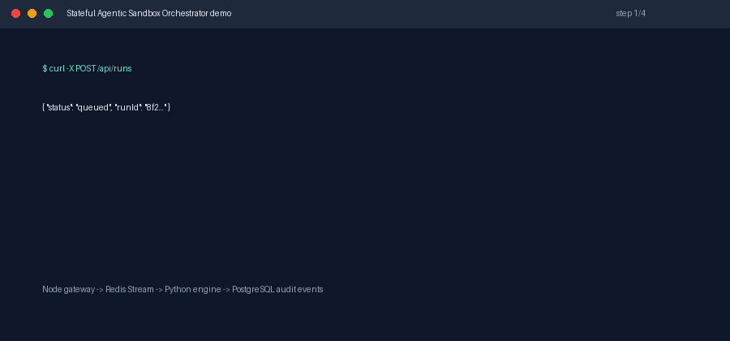
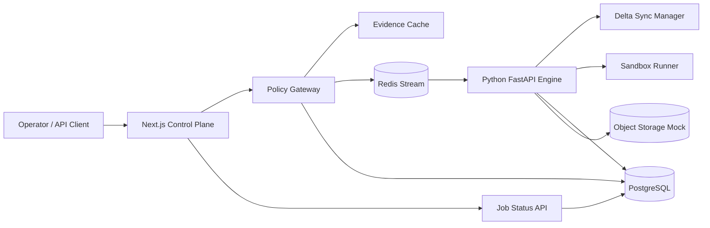

# Stateful Agentic Sandbox Orchestrator

[](https://github.com/Daniel5569/stateful-agentic-sandbox-orchestrator/actions/workflows/ci.yml)


Production-shaped portfolio case study for early-stage AI infrastructure teams building terminal-use agents, remote sandboxes, and long-running asynchronous execution systems.

This monorepo demonstrates a bicephalous Node.js + Python architecture:

- **Node.js / Next.js** owns the product surface, API gateway, policy validation, and queue admission control.
- **Python / FastAPI** owns the computational runtime, sandbox lifecycle simulation, delta-based workspace hydration, and execution telemetry.
- **Redis Streams** decouple request admission from long-running agent execution through a cross-runtime queue contract.
- **PostgreSQL** persists jobs, policy decisions, sandbox manifests, and execution events.
- **Docker Compose** runs the full stack locally without leaking secrets.

The project is intentionally built as a public proof of work: it is small enough to inspect, but it contains the same control-plane boundaries used by real agentic infrastructure companies.

## Why This Exists

Terminal-use and code-executing agents fail in production when infrastructure teams treat them like normal request/response web apps. The hard problems are not only prompt quality. They are:

- keeping execution state warm without trusting local disk,
- enforcing deterministic policy decisions before runtime execution,
- avoiding serverless timeout ceilings,
- making sandbox state inspectable after failure,
- providing enough audit evidence to debug unsafe behavior,
- preserving low admission latency while long jobs run elsewhere.

This system addresses those problems with an asynchronous split between a gateway and a sandbox engine.

## Demo



The demo shows the intended operator flow: submit a run, receive `202 Accepted`, poll the run state, then inspect persisted execution events after the Python engine finishes the sandbox job.

## Architecture



## Runtime Boundaries

```text
apps/web
  Next.js API gateway, admission control, Redis stream producer, policy compiler

services/engine
  FastAPI internal health API, Redis stream consumer group, delta sync engine, sandbox runner

packages/shared
  Cross-runtime JSON contracts and examples

infra
  PostgreSQL bootstrap SQL and policy examples
```

The gateway never blocks on agent execution. It validates policy, persists an accepted job, enqueues work, and returns a job id. The Python engine consumes jobs asynchronously through a Redis consumer group and writes incremental events.

## Asynchronous Flow

```text
1. Client submits an agent run request to POST /api/runs.
2. Node validates the YAML policy into deterministic in-memory constraints.
3. Node stores the policy evidence and job metadata in PostgreSQL.
4. Node publishes the job to Redis and immediately returns 202 Accepted.
5. Python worker consumes the job from Redis.
6. Python computes a workspace delta from the object-storage manifest.
7. Python hydrates only changed files into the sandbox workspace.
8. Python runs the sandbox command through a constrained runner.
9. Python writes events, timings, risk flags, and final status to PostgreSQL.
10. Client polls GET /api/runs/:id or observes events from the database/API.
```

## Evidence Cache

The Node gateway compiles YAML policies into deterministic constraint trees:

```yaml
policy_id: default-terminal-sandbox
network:
  allow: false
filesystem:
  writable_paths:
    - /workspace
execution:
  max_seconds: 45
  denied_commands:
    - curl
    - nc
    - ssh
```

The compiled cache is stored in memory and versioned by a SHA-256 digest. This makes admission checks fast, reproducible, and auditable. The test suite enforces a representative admission budget under 100ms for normal policies.

## Performance Characteristics

These numbers are local reference characteristics, not hosted production SLOs. They are included so the claims are inspectable and can be re-run or challenged during a technical interview.

| Path | Methodology | Reference Result | Guardrail |
| --- | --- | --- | --- |
| Policy admission | Vitest compiles a representative YAML policy and validates the deterministic constraint tree | single-digit milliseconds on localhost | `<100ms` test assertion |
| Queue admission | Next.js writes one accepted run to PostgreSQL and appends one Redis Stream entry | one network round trip to Postgres plus one Redis `XADD` | no synchronous engine call |
| Delta sync warm start | Pytest hydrates the same workspace twice and compares file hashes | second run copies `0` files | unchanged files must remain untouched |
| Sandbox timeout | Pytest executes a sleeping process with an immediate timeout | process is killed and marked `timedOut=true` | no unbounded execution |

For a production benchmark, run the stack with Docker and sample admission latency at the gateway while the engine consumes stream entries in parallel. The intended measurement is p50/p95/p99 over `POST /api/runs`, Redis stream lag, and delta-sync file counts per run.

## Delta Sync Model

Cold-start latency is reduced by avoiding full workspace downloads. The engine compares:

- central manifest: object storage snapshot of expected files,
- local manifest: current hydrated workspace files,
- deterministic hash digests: SHA-256 per file.

Only changed files are copied into the sandbox workspace. Deleted files are removed. The resulting delta manifest is persisted with each run.

## Security Model

This repository uses a portable sandbox runner for local demonstration. The boundary is intentionally designed so that it can be replaced by Bubblewrap, Docker namespaces, Firecracker, gVisor, or a remote sandbox provider.

Implemented controls:

- admission policy compilation before queueing,
- denied command validation,
- read-only policy evidence persistence,
- isolated per-job workspace directory,
- bounded execution timeout,
- structured execution events,
- Docker network isolation: only the Node gateway exposes a host port,
- no secrets committed to the repository.

Production extensions:

- Bubblewrap profile generation,
- seccomp/AppArmor policy,
- egress proxy with allow-listing,
- object storage backed by S3/GCS/R2,
- short-lived signed workspace credentials,
- WebSocket event streaming,
- immutable audit log storage.

## Trade-Offs

| Decision | Benefit | Cost |
| --- | --- | --- |
| Redis queue between Node and Python | Avoids gateway timeout and runtime coupling | Requires queue observability |
| PostgreSQL for audit events | Strong relational integrity and easy inspection | Higher write overhead than append-only logs |
| YAML policies compiled in Node | Fast admission and deterministic evidence | Needs strict schema validation |
| Python execution engine | Excellent ecosystem for agents and runtime control | Two-runtime deployment complexity |
| Portable sandbox runner in demo | Works on macOS, Windows, and Linux dev machines | Not a real kernel isolation boundary |

## Prerequisites

- Node.js `>=20` (`.nvmrc` is included)
- Python `>=3.11`, developed with `3.12` (`.python-version` is included)
- Docker Engine `>=24`
- Docker Compose v2
- GitHub CLI `gh` for publication automation

## Local Development

```bash
cp .env.example .env
docker compose up --build
```

Web gateway:

```text
http://localhost:3000
```

The Python engine, Redis, and PostgreSQL are intentionally not exposed to the host in `docker-compose.yml`. They are reachable only inside the Docker internal network.

Inspect the internal engine health endpoint:

```bash
docker compose exec engine python -c "import urllib.request; print(urllib.request.urlopen('http://localhost:8000/health').read().decode())"
```

Submit a run:

```bash
curl -X POST http://localhost:3000/api/runs \
  -H "content-type: application/json" \
  -d '{
    "agentId": "portfolio-agent",
    "command": "python -c \"print(42)\"",
    "workspaceRef": "demo-workspace",
    "policyYaml": "policy_id: default-terminal-sandbox\nnetwork:\n  allow: false\nfilesystem:\n  writable_paths:\n    - /workspace\nexecution:\n  max_seconds: 20\n  denied_commands:\n    - curl\n    - nc\n"
  }'
```

## Testing

Node gateway:

```bash
cd apps/web
npm ci
npm test
npm run build
npm run audit
```

Python engine:

```bash
cd services/engine
python -m pip install -e ".[dev]"
python -m pytest
```

Full integration in GitHub Actions runs with real PostgreSQL and Redis service containers by setting `RUN_DB_INTEGRATION=1`.

## CI/CD

The repository includes `.github/workflows/ci.yml` with two jobs:

- **Node gateway:** install, audit, unit tests, database/Redis integration test, Next.js build.
- **Python engine:** install FastAPI engine dependencies and run Pytest.


## Repository Narrative for Recruiters

This case study demonstrates infrastructure judgment:

- long-running work is not forced through synchronous HTTP,
- policy is compiled before execution,
- the computational engine is isolated from the product gateway,
- storage hydration is incremental,
- execution evidence is persisted for debugging and security review,
- all local services are reproducible through containers.

The code is intentionally readable because early-stage teams value engineers who can both build systems and explain them under pressure.
